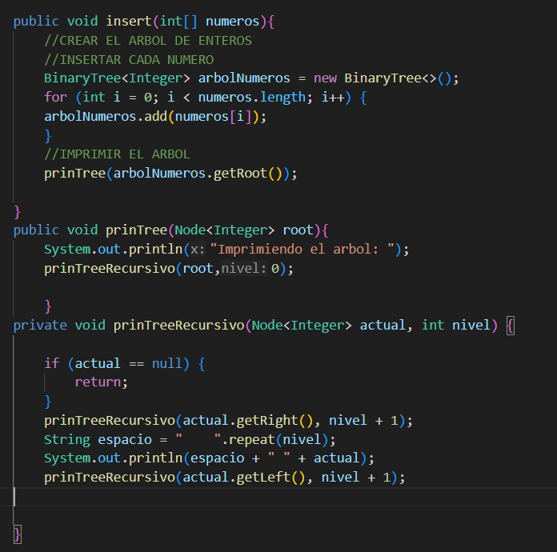
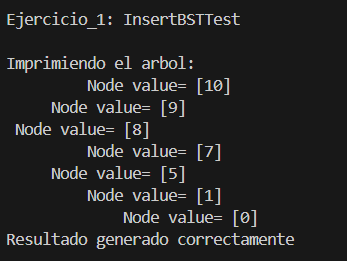
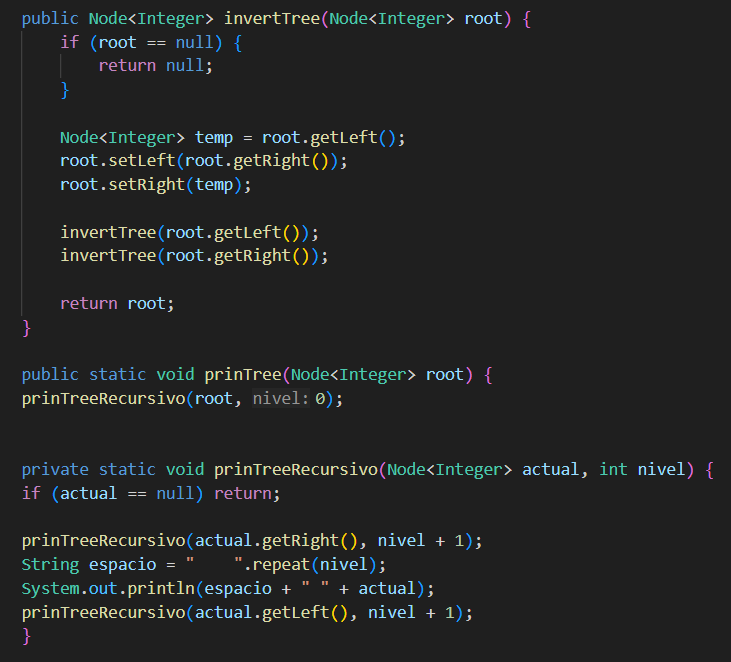
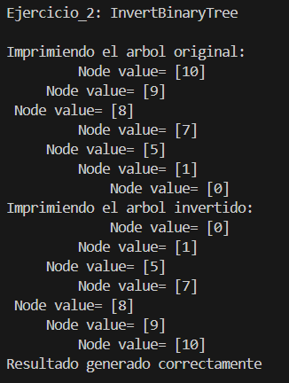
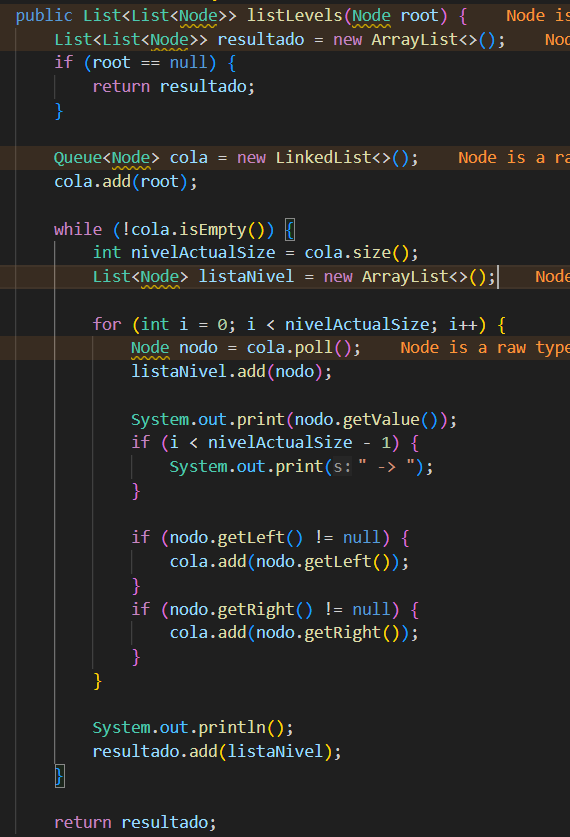
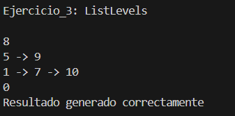
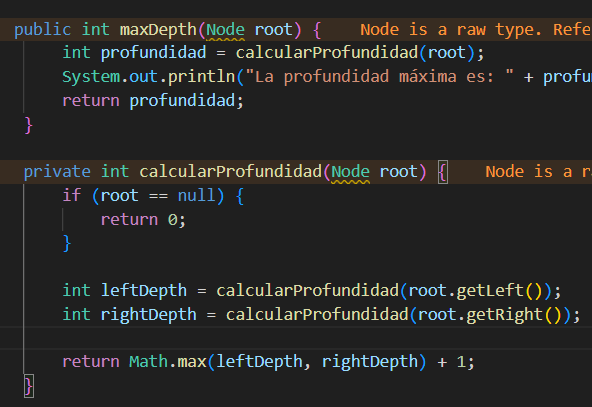
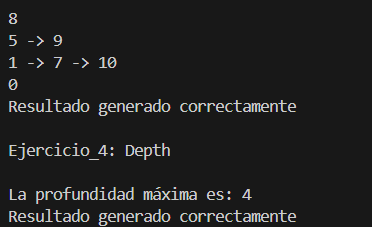

## Recursividad y Arboles

- **Nombre:** Alfonso Auquilla-Stephan Cedillo-Oliver Valdiviezo
- **Curso:** Estructura de Datos
- **Fecha:** 23/6/2026

**Descripción:** Este proyecto trata sobre cómo organizar numeros en este caso de forma inteligente usando árboles binarios, donde cada dato se conecta con otros. Básicamente, construimos caminos" de datos usando nodos y aprendimos a movernos por ellos mediante recursividad,

## 1. Ejercicio_1
**Descripción:** Este código funciona como un organizador automático: toma una lista de números y los acomoda en un árbol, donde cada valor se coloca a la izquierda o derecha según sea menor o mayor. Para ver el resultado, usamos una función de visualización que recorre el árbol de forma recursiva; al añadir espacios que se multiplican según la profundidad, logramos "dibujar" el árbol de lado en la consola, permitiéndonos ver claramente cómo se conectan las ramas y niveles de forma jerárquica.
**Codigo**

**Salida**

## 1. Ejercicio_2
**Descripción:** El código funciona de manera recursiva: empieza en la raíz y, al llegar a cada nodo, simplemente es el reflejo sus conexiones. Si el nodo tenía un hijo izquierdo, lo mueve a la derecha, y el hijo derecho lo mueve a la izquierda, repitiendo este proceso hasta llegar a todas las hojas. Al finalizar, habremos creado una imagen especular de nuestro árbol original, manteniendo la jerarquía pero con los lados totalmente invertidos.
**Codigo**

**Salida**

## 1. Ejercicio_3
**Descripción:** Este ejercicio se trata de leer el árbol por "pisos" en lugar de seguir las ramas. Usamos una cola para ir guardando los nodos nivel por nivel, lo que nos permite visitar primero a los hijos de la raíz, luego a sus nietos, y así sucesivamente. En la práctica, es como si estuviéramos barriendo el árbol horizontalmente; esto es genial porque nos da una vista panorámica de qué números viven en la misma profundidad, organizándolos en listas separadas para que podamos ver claramente la estructura completa del árbol sin perdernos en las ramas.
**Codigo**

**Salida**

## 1. Ejercicio_4
**Descripción:** EAquí lo que hacemos es medir qué tan "largo" es el árbol desde la raíz hasta el punto más profundo. Lo logramos mediante recursividad, donde cada nodo le pregunta a sus hijos quién de ellos tiene el camino más largo hacia el fondo; al final, cada nodo suma uno a ese valor más alto. Es un proceso de "abajo hacia arriba": las hojas reportan que tienen profundidad 1, y los padres van acumulando ese conteo hasta que llegamos a la raíz con la respuesta final, que nos dice cuántos niveles tiene nuestra estructura.
**Codigo**

**Salida**

# Conclusiones:

## conclusion 1:
 Al trabajar con la recursividad, aprendí que al procesar cada nodo de forma repetitiva y automática, puedo resolver problemas complejos, como calcular la profundidad o invertir ramas, con soluciones mucho más limpias.

## conclusion 2:
Comprendí que el proyecto funciona como un sistema de cajas interconectadas. Al usar los getters y setters para moverme entre nodos, vi claramente cómo estamos construyendo caminos físicos, entendí que, mientras la clase BinaryTree define la arquitectura, son estos pequeños métodos de acceso los que realmente permiten que el árbol deje de ser una colección de piezas sueltas y se convierta en una estructura navegable.

## conclusion 3:
Reconozco que los ejercicios fueron un reto complicado, especialmente al implementar herramientas como las colas para recorrer árboles por niveles. Aprendí que, para usar los árboles, en algunos ejercicios es
necesario usar colas para una mejor organizacion y resolucion del problema.

